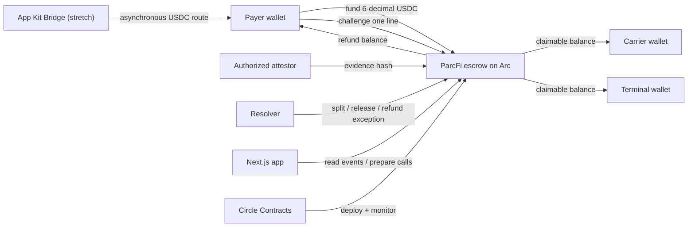

# ParcFi Idea Validation and Deep Research

Research date: 2026-07-24

## Executive Verdict

### Original proposal: no-go

The broad idea—stablecoin freight payments, delivery-triggered escrow, multi-party waterfalls, FX, cross-chain payouts, wallets, privacy, and telemetry—is not defensible or buildable in the remaining hackathon window.

Score: **3/10**

- CargoBill is active and accelerator-backed.
- CargoEscrow publicly markets USDC delivery escrow, milestones, telemetry, disputes, and mediation.
- CargoX and Standage are preparing a real eBL/stablecoin atomic-settlement pilot for September 2026.
- PayCargo already owns a large logistics-payment network.
- Several product claims depend on permissioned or unavailable Circle/Arc features.

### Narrowed hackathon product: conditional go

Build ParcFi as an invoice-exception settlement primitive:

> ParcFi releases the undisputed line items of a freight invoice immediately and holds only the exceptions in programmable USDC escrow.

Hackathon score: **7.5/10**, if the demo is narrow and complete.

Startup score today: **4.5/10**, because willingness to pre-fund, dispute frequency, buyer, corridor, pricing, compliance model, and attestation governance are not yet validated with customers.

## Validation Scorecard

| Dimension | Score | Evidence-backed conclusion |
|---|---:|---|
| Problem reality | 8/10 | DCSA is designing a maritime invoicing standard because layered surcharges, demurrage, tax, validation, and execution are complex. Freight-audit vendors describe exception queues as a payment-delay driver. |
| Buyer urgency | 5/10 | The pain is real, but incumbent AP, TMS, audit, and payment networks already solve parts of it. Switching and wallet onboarding are substantial friction. |
| Original idea differentiation | 2/10 | CargoBill, CargoEscrow, and CargoX/Standage make the broad thesis visibly derivative. |
| Narrowed wedge differentiation | 6/10 | "Release clean lines, hold exceptions" is clearer and more programmable than generic payment, delivery escrow, or audit-only tools, but interviews must confirm the workflow gap. |
| Hackathon technical feasibility | 8/10 | Arc Testnet, custom Circle Contracts, user-controlled wallets, Arc USDC, and App Kit are available now. |
| Production readiness | 3/10 | Arc mainnet is upcoming, privacy is unavailable, and legal/custody/compliance questions are unresolved. |
| Hackathon fit | 9/10 | Conditional payments, multi-step settlement, Arc/USDC, Circle Wallets, and Circle Contracts map directly to the DeFi criteria. |

## The Product Worth Building

### Customer hypothesis

Start with small/mid-market freight forwarders that manage several service providers and cannot justify enterprise freight-audit/payment software. They coordinate the invoice and feel the operational pain across shipper and payee.

This is a hypothesis, not a confirmed ICP.

### Job to be done

When one charge on a multi-party freight invoice is contested, pay every accepted obligation on time while preserving the money and evidence needed to resolve the exception.

### Golden-path scenario

A synthetic $10,000 freight invoice contains:

1. Base freight: $7,500 to the carrier.
2. Port handling: $1,500 to the terminal.
3. Demurrage: $1,000 to the forwarder.

The payer funds Arc Testnet USDC. Signed evidence starts a challenge window. Base freight and port handling become independently claimable. The payer disputes demurrage. The carrier and terminal withdraw without waiting. The resolver later splits demurrage 60/40 between payee and refund.

### Why it is different

- It is not a faster "send/request" wallet.
- It does not wait for one delivery event to release a whole shipment payment.
- It does not pretend a PDF hash is a legal eBL or proof of title.
- It does not merely flag invoice errors.
- It atomically records entitlements on Arc, then lets each compliant beneficiary claim independently.

## Market Evidence

### Strong signals

- DCSA's 2026 roadmap says maritime invoicing has layered surcharges, demurrage rules, and varying tax structures. Its invoicing standard entered discovery in Q1 2026, with alpha targeted for September and beta for November. DCSA explicitly connects standard data exchange to automated payment validation and execution.
- DCSA reports that eBL digitization could save $6.5B in direct costs and enable $30–40B in annual trade growth. This proves large document friction, but it is **not** ParcFi's addressable revenue and must not be used as its TAM.
- PayCargo self-reports 150,000+ businesses, 6,500+ vendors, and $45B+ of logistics transactions since 2021. That validates a large category while also showing the power of incumbent distribution.
- PayCargo's product includes invoice automation, payment matching, refunds, real-time release, and demurrage/detention workflows. "Faster logistics payments" alone is not a wedge.
- Freight-audit vendors market line-item exception detection and say exceptions delay carrier payment. This supports the workflow problem, though vendor claims should be treated as directional.

### Weak or missing signals

- No primary customer interviews yet.
- No evidence yet that target payers will pre-fund stablecoin escrow.
- No quantified share of invoices where a single line freezes the full invoice for the target segment.
- No evidence that a blockchain is preferred to an escrow account, ACH network, or ERP workflow.
- No confirmed party willing to act as attestor or dispute resolver.

## Competitive Landscape

| Product | What it already does | Implication for ParcFi |
|---|---|---|
| CargoBill | Active Solana stablecoin payment product for supply-chain firms; send/request, non-custodial payments, shipment context. | Invalidates generic "stablecoin payments for logistics." |
| CargoEscrow | Publicly markets Solana USDC delivery escrow, milestones, telemetry, Incoterms templates, disputes, and mediation at a self-reported 1% fee. | Invalidates delivery escrow as the differentiation; some claims appear promotional, but judges can still find it. |
| PayCargo | Large logistics payment network with bank rails, AP automation, reconciliation, cargo release, finance, and demurrage workflows. | Competing on payment speed or network breadth is unrealistic. |
| OpenEnvoy / Trax | Line-item freight audit, exception detection, ERP workflows, and freight-payment operations. | ParcFi must complement audit by segregating and settling the money, not claim to discover invoice errors better. |
| CargoX + Standage | Planned real-world atomic eBL/stablecoin exchange for a Japan–Germany corridor. | Do not touch title transfer, eBL issuance, or goods settlement in the MVP. |

The remaining wedge is **programmable exception isolation**: finality for accepted obligations without sacrificing control over contested ones.

## Technical Validation

### Feasible now

- Arc Public Testnet is live and permissionless for developers.
- Arc is EVM compatible, with important differences.
- USDC is Arc's native asset and also exposes an ERC-20 interface. Native accounting uses 18 decimals; application transfers/allowances use 6 decimals. The contract must use the ERC-20 interface consistently.
- Circle Contracts supports custom bytecode/ABI deployment on Arc Testnet.
- Circle modular wallets are user-controlled, passkey-backed smart accounts with gas sponsorship and batched operations.
- Arc App Kit supports Send, Bridge, Swap, and Unified Balance on Arc Testnet. Bridge supports USDC.

### Feasible but non-core

- App Kit can bridge USDC between Ethereum Sepolia and Arc Testnet.
- CCTP standard-transfer attestation from Arc Testnet is documented at roughly 0.5 seconds, but the burn, attestation, and destination mint are separate steps.
- CCTP Hooks are metadata; the core protocol does not execute application hook logic. Cross-chain recovery remains an integrator concern.

### Not available or unsuitable

- Arc privacy is still on the roadmap. Contract amounts and addresses are public.
- StableFX is permissioned and currently documents USDC/EURC, not JPYC. A spot conversion at delivery does not hedge a multi-week voyage.
- Compliance Engine is restricted to eligible customers, so it cannot be a critical hackathon dependency.
- Arc mainnet is upcoming and mainnet contract addresses are not public. The demo cannot be called production-ready.

## Recommended Architecture

Core contract states per obligation:

`Pending -> Attested -> Challenged | Finalizable -> Claimable -> Claimed`

Alternative paths:

`Challenged -> Resolved -> Claimable and/or Refundable`

`Pending/Attested -> Expired -> Refundable`

Agreement-level status should be derived from obligation/accounting state rather than a brittle single global enum.

## Commercial and Unit-Economics Check

Full voyage pre-funding is usually the wrong default.

Illustrative only:

- $50,000 locked for 21 days at a 12% annual cost of capital costs about $345.
- Releasing $45,000 of undisputed charges 20 days early is worth about $296 in financing time at the same rate.
- A 20 bps settlement fee on $45,000 is $90.

This shows:

1. Working-capital timing can dominate chain fees.
2. Funding at invoice approval or milestone is more credible than locking 100% at booking.
3. The carrier/payee may value acceleration more than the payer; the fee payer is an open question.

Pricing hypotheses to test:

- Monthly workflow fee plus 10–30 bps on successfully released value.
- Payee-funded optional acceleration fee.
- Flat per-agreement fee for small invoices.

Do not use a 1% fee assumption without interviews; it becomes unreasonable on large invoices.

## Legal, Compliance, and Trust Risks

- A smart contract does not eliminate licensing. Control over wallets, transaction initiation, fee taking, or dispute custody may trigger VASP, money-transmission, escrow, safeguarding, or payment-services rules depending on the corridor.
- FATF reports broad Travel Rule adoption and heightened stablecoin/unhosted-wallet risk. A production system needs KYB, sanctions controls, originator/beneficiary data handling, suspicious-activity processes, and corridor analysis.
- Nigeria's SEC rules cover platforms facilitating virtual-asset transfer while excluding some pure technology providers. The actual operating model determines the category.
- Circle's wallet compliance rules restrict transactions involving sanctioned addresses; a compliance failure can freeze an outbound wallet.
- Hashing a document proves integrity, not truth, delivery, legal title, or signer's authority.
- Pull-based claims isolate a failed/blocked beneficiary technically, but do not solve the legal ownership of held funds.
- A resolver needs contractual authority, service levels, conflict rules, and an enforceable governing-law clause.

Production principle: the software should orchestrate a licensed provider or clearly non-custodial contract model after corridor-specific legal review. Do not launch real-value escrow from the hackathon prototype.

## Falsification Plan

Run at least eight interviews:

- 3 freight forwarder finance/operations leads.
- 2 shipper AP/logistics leads.
- 2 carrier or service-provider finance leads.
- 1 freight-audit/payment specialist.

Ask for the most recent disputed invoice, not opinions about blockchain:

1. Walk me through the last invoice that missed its payment date.
2. Which line caused the exception?
3. Was the undisputed balance paid or held?
4. How many people/systems touched it and for how long?
5. Who had authority to approve evidence and resolve the dispute?
6. What did the delay cost: fees, financing, cargo hold, relationship, or staff time?
7. At what point could funds have been committed safely?
8. Would you use or pay for partial settlement if counterparties used embedded wallets?

Conditional go after interviews:

- At least 5 of 8 report line-level exceptions that materially delay otherwise payable value.
- At least 3 can quantify days, amount, or staff effort.
- At least 2 share a redacted workflow/invoice structure or agree to test the prototype.
- At least 1 target buyer requests a follow-up or design-partner session.

Pivot/kill the startup thesis if:

- Most teams already pay undisputed lines easily.
- Delays are caused primarily by missing cash rather than reconciliation/trust.
- No credible party will pre-fund or accept stablecoin.
- Wallet/compliance onboarding costs exceed the operational benefit.

The hackathon prototype can still be worthwhile even if the startup thesis is falsified.

## Hackathon Fit and Deadline

Current official brief:

- Track: DeFi.
- Checkpoint 2: 2026-07-26 — repository link and progress summary.
- Registration closes: 2026-08-08.
- Final: 2026-08-09 AOE — functional MVP deployed on Arc, public repository, three-minute video/demo, and deck.
- Demo Day: 2026-08-20.
- Judging: Arc/USDC integration, appropriate core products, real use case/path to production, and execution/presentation.
- Prize: up to eight top teams receive an eight-week accelerator placement; no cash prize is stated on the current page.

Pitch sequence:

1. "One disputed demurrage line should not freeze every legitimate payee."
2. Show three invoice obligations.
3. Dispute only one.
4. Claim two immediately.
5. Resolve the exception.
6. Show Arc transaction evidence and Circle integration.
7. End with the production path and honest limitations.

## Sources

Hackathon and platform:

- [Programmable Money Hackathon](https://www.encodeclub.com/programmes/arc-hackathon)
- [Arc hackathon event brief](https://community.arc.io/public/events/hackathon-programmable-money-74llz8htis)
- [Arc deployment model](https://docs.arc.io/arc/concepts/deployment-model)
- [Arc EVM differences](https://docs.arc.io/arc/references/evm-differences)
- [Arc contract addresses](https://docs.arc.io/arc/references/contract-addresses)
- [Arc opt-in privacy](https://docs.arc.io/arc/concepts/opt-in-privacy)
- [Arc App Kit](https://docs.arc.io/app-kit)
- [App Kit supported blockchains](https://docs.arc.io/app-kit/references/supported-blockchains)
- [Circle Contracts](https://developers.circle.com/contracts)
- [Circle modular wallets](https://developers.circle.com/wallets/modular)
- [Circle Compliance Engine](https://developers.circle.com/wallets/compliance-engine)
- [CCTP technical guide](https://developers.circle.com/cctp/references/technical-guide)
- [CCTP finality](https://developers.circle.com/cctp/concepts/finality-and-block-confirmations)

Market and standards:

- [DCSA Standards Roadmap 2026](https://dcsa.org/newsroom/dcsa-standards-roadmap-2026)
- [DCSA eBL legal and regulatory barriers](https://dcsa.org/newsroom/overcoming-legal-and-regulatory-barriers-to-ebl-adoption)
- [DCSA 100% eBL commitment](https://dcsa.org/get-involved/100-percent-ebl)
- [UNCITRAL MLETR](https://uncitral.un.org/en/texts/ecommerce/modellaw/electronic_transferable_records)

Competition:

- [CargoBill](https://www.cargobill.co/)
- [CargoBill company profile](https://colosseum.com/companies/cargobill)
- [CargoEscrow](https://cargoescrow.com/)
- [PayCargo payments](https://paycargo.com/payments)
- [PayCargo Container Payment Portal](https://paycargo.com/container-payment-portal/)
- [OpenEnvoy freight audit](https://www.openenvoy.com/automated-freight-audit-software)
- [Trax freight audit](https://www.traxtech.com/products/freight-audit)
- [CargoX and Standage eBL/stablecoin pilot](https://standage.jp/2026/06/01/cargox-ebl-stablecoin-atomic-swap/)

Compliance:

- [FATF 2026 virtual-asset update](https://www.fatf-gafi.org/en/publications/Fatfrecommendations/targeted-updated-virtualassets-vasps-2026.html)
- [Nigeria SEC digital-asset/VASP rules](https://sec.gov.ng/documents/8/Rules-on-Issuance-Offering-and-Custody-of-Digital-Assets.pdf)
