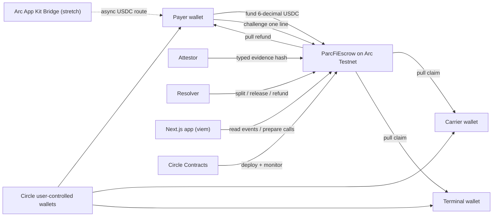

# ParcFi

**One disputed demurrage line should not freeze every legitimate payee.**

> ParcFi releases the undisputed line items of a freight invoice immediately and holds only the exceptions in programmable USDC escrow on [Arc](https://docs.arc.network).

Built for the Arc **Programmable Money Hackathon** (Encode Club), DeFi track. Arc Testnet and synthetic data only.

## The problem

A multi-party freight invoice bundles obligations to different companies — carrier, terminal, forwarder, broker. When one accessorial charge (demurrage, detention, a surcharge) is contested, today's AP workflows tend to hold the entire invoice in an exception queue. Every other payee waits on a dispute that has nothing to do with them. DCSA is standardizing maritime invoicing precisely because layered surcharges and demurrage rules make this reconciliation hard.

## What ParcFi does differently

Each invoice line becomes an **independently settleable USDC obligation** with its own evidence requirement, challenge window, and lifecycle:

- Attested, unchallenged lines finalize on schedule — each beneficiary **pulls** their own funds; one blocked or failing recipient cannot freeze another's entitlement.
- A challenged line is quarantined with its money conserved until a mutually appointed resolver splits, releases, or refunds **only that line**.
- Documents stay off-chain; only content hashes and typed metadata are anchored.

| They do | Products | ParcFi's difference |
|---|---|---|
| Move logistics money faster | CargoBill, PayCargo | Not a payment rail — it settles *entitlements* per line, disputes included |
| Escrow a shipment against delivery | CargoEscrow | No single delivery event gates the whole payment; lines settle independently |
| Find invoice exceptions | OpenEnvoy, Trax | Complements audit: segregates and settles the money the audit flags |
| Swap eBL title against payment | CargoX × Standage | ParcFi never touches title, eBL issuance, or goods payment |

## Golden-path demo (what the final submission shows)

A synthetic $10,000 invoice with three obligations:

| # | Line | Beneficiary | Amount | Evidence |
|---|---|---|---:|---|
| 0 | Base ocean freight | Carrier | $7,500 | `SIGNED_POD` |
| 1 | Port handling | Terminal | $1,500 | `PORT_RECEIPT` |
| 2 | Demurrage | Forwarder | $1,000 | `DEMURRAGE_STATEMENT` |

1. Payer funds 10,000 USDC into the agreement on Arc Testnet.
2. The attestor submits typed evidence hashes; challenge windows open.
3. The payer disputes **only** demurrage.
4. After the window, base freight and port handling finalize — carrier and terminal each claim independently, without waiting.
5. The resolver splits demurrage 60/40: $600 to the forwarder, $400 back to the payer.
6. Every step is an indexed on-chain event with an explorer link.

## Architecture

Per-obligation lifecycle: `Pending → Attested → (Challenged → Resolved) | Finalized`, with `Pending → Expired` refunds after agreement expiry. Full state machine, accounting invariants, events, and errors: [contracts/SPEC.md](contracts/SPEC.md); interface: [IParcFiEscrow.sol](contracts/src/interfaces/IParcFiEscrow.sol).

**Circle / Arc integrations:** Arc Testnet USDC (6-decimal ERC-20 interface) · Circle user-controlled modular wallets · Circle Contracts deployment — plus Arc App Kit Bridge as a stretch feature. Contract events are the settlement source of truth.

## Status and schedule

| Date | Milestone | Status |
|---|---|---|
| 2026-07-26 | Checkpoint 2 — thesis, spec, scaffold, this repo | In progress |
| 2026-07-30 | Contract core: Foundry unit + fuzz + invariant suites green | **Done early** (74 tests + adversarial security review, 07-24) |
| 2026-08-04 | End-to-end demo on Arc Testnet (wallets, UI, explorer links) | In progress — golden path verified locally; Arc deployment next |
| 2026-08-08 | Hardening, deck, 3-minute video, final submission (internal deadline) | Planned |

Project memory, research, and phase plans live in [.planning/](.planning/) — start with [RESEARCH.md](.planning/RESEARCH.md) for the validation evidence and competitive analysis.

## Repository layout

- [contracts/](contracts/) — Foundry project: [SPEC.md](contracts/SPEC.md), `ParcFiEscrow.sol`, 74 tests (unit, fuzz, invariant campaigns), security-review record.
- [apps/web/](apps/web/) — Next.js demo app — the full golden path works locally against anvil; [run it in four commands](apps/web/README.md).
- [packages/shared/](packages/shared/) — generated ABI, typed chain/status/format helpers, and the [synthetic invoice fixture](packages/shared/fixtures/golden-path-invoice.json).
- [.planning/](.planning/) — GSD project memory: research, requirements, roadmap, phase plans, verification records.

## Honest limitations

- **Testnet prototype**, not production: Arc mainnet is upcoming; legal, licensing, custody, and compliance questions are unresolved and documented in [RESEARCH.md](.planning/RESEARCH.md).
- An evidence hash proves document integrity — not truth, delivery, or legal title. ParcFi is not an eBL platform and does not settle the underlying goods.
- Amounts and addresses are public on Arc Testnet; no privacy claims.
- Commercial hypotheses (who pays, pre-funding willingness, corridor) are unvalidated until customer interviews conclude; nothing here is investment or legal advice.
- A challenged line waits for its resolver — resolver-timeout governance is a documented production gap, not an MVP feature.
