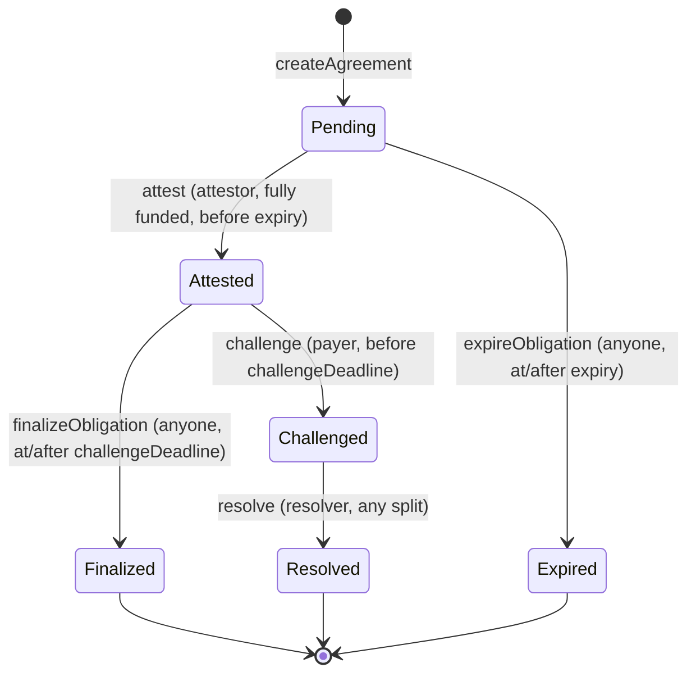

# ParcFiEscrow Contract Specification

Version: 0.1 (Phase 001, 2026-07-24). This document is the acceptance contract for the Phase 002 implementation. Requirements references (F-xx, NF-xx) point to `.planning/REQUIREMENTS.md`.

## Purpose

One contract instance holds many independent **agreements**. An agreement escrows Arc Testnet USDC against a bounded set of **line-item obligations** from one freight invoice. Each obligation settles independently: attested and unchallenged obligations finalize into pull-based claims; challenged obligations are quarantined for a resolver; nothing an obligation does can block a sibling obligation (F-06, F-07).

## Roles (per agreement, immutable after creation)

| Role | Set at | Powers |
|---|---|---|
| `payer` | creation (caller) | Fund; challenge an attested obligation before its deadline; withdraw refunds; reclaim funds if the agreement never fully funds. |
| `attestor` | creation | Submit one typed evidence hash per obligation (F-04). |
| `resolver` | creation | Decide a challenged obligation by splitting its amount between beneficiary and payer (F-08). |
| `beneficiary` | per obligation | Withdraw their own claimable balance (F-07). |
| anyone | — | `finalizeObligation` and `expireObligation` are permissionless keeper functions: they only move an obligation along transitions whose conditions are already objectively true. |

There is no owner, no admin, no upgradeability, and no pause. The deployer holds no power over funds (NF-02).

## Data Model

```solidity
enum ObligationStatus { Pending, Attested, Challenged, Finalized, Resolved, Expired }

struct Obligation {
    address beneficiary;
    uint256 amount;                  // 6-decimal USDC units
    bytes32 requiredEvidenceType;    // e.g. bytes32("SIGNED_POD") — typed metadata, never a document body
    uint64  challengeDuration;       // seconds
    ObligationStatus status;
    bytes32 evidenceHash;            // content hash only (NF-06)
    uint64  attestedAt;
    uint64  challengeDeadline;       // attestedAt + challengeDuration
}

struct Agreement {
    address payer;
    address attestor;
    address resolver;
    bytes32 docHash;                 // invoice content hash, anchored only
    uint64  expiry;                  // unix seconds
    uint16  obligationCount;         // 1..MAX_OBLIGATIONS
    bool    fullyFunded;             // latches true when fundedTotal == requiredTotal
    uint256 requiredTotal;           // Σ obligation amounts, fixed at creation
    uint256 fundedTotal;             // cumulative deposits, never exceeds requiredTotal
    uint256 locked;                  // value backing non-terminal obligations once fully funded
    uint256 cumulativeClaimed;       // paid out to beneficiaries
    uint256 cumulativeRefunded;      // paid out to payer (refunds + unfunded reclaim)
}
```

Ledgers are per agreement and per address, so one blocked address never touches another's entitlement:

```solidity
mapping(uint256 => mapping(address => uint256)) claimable;   // credited by finalize/resolve
mapping(uint256 => mapping(address => uint256)) refundable;  // credited by resolve/expire
```

## State Machine (per obligation)



### Transition table

| # | Function | Caller | Preconditions | Effects | Event |
|---|---|---|---|---|---|
| T1 | `createAgreement(docHash, attestor, resolver, expiry, ObligationInput[])` | anyone (becomes payer) | `1 ≤ n ≤ 16`; every amount > 0; no zero addresses; `expiry > now`; every `challengeDuration` in `[MIN_CHALLENGE, MAX_CHALLENGE]` | Agreement stored; all obligations `Pending`; `requiredTotal = Σ amounts` | `AgreementCreated` + `ObligationCreated` per line |
| T2 | `fund(id, amount)` | payer | `amount > 0`; `fundedTotal + amount ≤ requiredTotal` (over-funding reverts — see Funding) | `fundedTotal += amount`; if now equal to `requiredTotal`: `fullyFunded = true`, `locked = requiredTotal` | `Funded`, then `FullyFunded` when latched |
| T3 | `attest(id, oid, evidenceHash, evidenceType)` | attestor | status `Pending`; `fullyFunded`; `now < expiry`; `evidenceType == requiredEvidenceType`; `evidenceHash != 0` | status `Attested`; record hash; `challengeDeadline = now + challengeDuration` | `Attested` |
| T4 | `challenge(id, oid)` | payer | status `Attested`; `now < challengeDeadline` | status `Challenged` | `Challenged` |
| T5 | `finalizeObligation(id, oid)` | anyone | status `Attested`; `now ≥ challengeDeadline` | status `Finalized`; `locked -= amount`; `claimable[id][beneficiary] += amount` | `ObligationFinalized` |
| T6 | `resolve(id, oid, amountToBeneficiary)` | resolver | status `Challenged`; `amountToBeneficiary ≤ amount` | status `Resolved`; `locked -= amount`; `claimable[id][beneficiary] += amountToBeneficiary`; `refundable[id][payer] += amount − amountToBeneficiary` | `ObligationResolved` |
| T7 | `expireObligation(id, oid)` | anyone | status `Pending`; `fullyFunded`; `now ≥ expiry` | status `Expired`; `locked -= amount`; `refundable[id][payer] += amount` | `ObligationExpired` |
| T8 | `reclaimUnfunded(id)` | payer | `!fullyFunded`; `now ≥ expiry`; `fundedTotal > 0`; obligations still `Pending` (obligation 0 suffices: pre-full-funding, T8 is the only reachable transition and it flips all lines, so a second call reverts with `InvalidStatus`) | all obligations → `Expired`; transfer `fundedTotal` to payer; `cumulativeRefunded += fundedTotal` | `ObligationExpired` per line + `UnfundedReclaimed` |
| T9 | `claim(id)` | anyone with balance | `claimable[id][msg.sender] > 0` | zero the balance, transfer, `cumulativeClaimed += amount` | `Claimed` |
| T10 | `withdrawRefund(id)` | anyone with balance | `refundable[id][msg.sender] > 0` | zero the balance, transfer, `cumulativeRefunded += amount` | `RefundWithdrawn` |

Boundary rule (NF-05 test target): challenge requires strictly `now < challengeDeadline`; finalize requires `now ≥ challengeDeadline`. No timestamp satisfies both; every timestamp satisfies one.

### Funding model

- The payer funds cumulatively; deposits that would exceed `requiredTotal` revert with `OverFunding`. This removes surplus tracking entirely: there is never unallocated value inside an agreement (NF-01 test: over-funding reverts, F-03 partial funding is visible as `fundedTotal < requiredTotal`).
- Attestation requires full funding. Therefore an under-funded agreement can only ever contain `Pending` obligations, which is what makes T8's whole-balance reclaim safe.
- Direct USDC transfers to the contract (donations) are not credited to any agreement and are unrecoverable by design; internal accounting never reads raw balance.

### Expiry semantics

`expiry` gates the *start* of an obligation's active lifecycle, never cuts one short: after expiry no new attestation is possible and `Pending` obligations become refundable, but an obligation already `Attested` proceeds through its challenge window normally and a `Challenged` obligation still waits for its resolver. Rationale: a challenge window that began before expiry must not be silently voided (F-09, no double-spend path: `Expired` is terminal and only reachable from `Pending`).

## Accounting Invariants (Phase 002 invariant-test targets, NF-01)

- INV-1 Conservation, per agreement, two regimes:
  - While `!fullyFunded`: `locked == 0`, both ledgers empty, `cumulativeClaimed == 0`, and `cumulativeRefunded ∈ {0, fundedTotal}` (zero before T8, exactly `fundedTotal` after).
  - Once `fullyFunded` (latched): `fundedTotal == requiredTotal == locked + Σ claimable[id][*] + Σ refundable[id][*] + cumulativeClaimed + cumulativeRefunded`.
- INV-2 Solvency, contract-wide: `usdc.balanceOf(this) ≥ Σ over agreements (fundedTotal − cumulativeClaimed − cumulativeRefunded)`. Equality holds absent donations. (The RHS term — an agreement's unspent value — equals `locked + outstanding claimable + outstanding refundable` once fully funded, and `fundedTotal` for an under-funded, unreclaimed agreement.)
- INV-3 Funding bound: `fundedTotal ≤ requiredTotal`; `fullyFunded ⟺ fundedTotal == requiredTotal`.
- INV-4 Isolation: any single transition touches exactly one obligation's stored state; sibling obligations' status and every other address's balances are unchanged (F-06, F-07).
- INV-5 Terminality: `Finalized`, `Resolved`, `Expired` never transition again; no obligation is ever both finalized and resolved.
- INV-6 Monotonicity: `cumulativeClaimed` and `cumulativeRefunded` never decrease; every credit to a ledger is produced by exactly one terminal transition (T5/T6/T7).
- INV-7 Bounds: `obligationCount ≤ 16` and every function is O(1) except T1 and T8, which are O(n ≤ 16).

## Events

All parties and IDs indexed for the UI's event-sourced read model (F-10):

```solidity
event AgreementCreated(uint256 indexed agreementId, address indexed payer, address attestor, address resolver, bytes32 docHash, uint64 expiry, uint256 requiredTotal, uint16 obligationCount);
event ObligationCreated(uint256 indexed agreementId, uint256 indexed obligationId, address indexed beneficiary, uint256 amount, bytes32 requiredEvidenceType, uint64 challengeDuration);
event Funded(uint256 indexed agreementId, uint256 amount, uint256 fundedTotal);
event FullyFunded(uint256 indexed agreementId);
event Attested(uint256 indexed agreementId, uint256 indexed obligationId, bytes32 evidenceHash, bytes32 evidenceType, uint64 challengeDeadline);
event Challenged(uint256 indexed agreementId, uint256 indexed obligationId);
event ObligationFinalized(uint256 indexed agreementId, uint256 indexed obligationId, address indexed beneficiary, uint256 amount);
event ObligationResolved(uint256 indexed agreementId, uint256 indexed obligationId, uint256 amountToBeneficiary, uint256 amountToPayer);
event ObligationExpired(uint256 indexed agreementId, uint256 indexed obligationId, uint256 amount);
event Claimed(uint256 indexed agreementId, address indexed beneficiary, uint256 amount);
event RefundWithdrawn(uint256 indexed agreementId, address indexed payer, uint256 amount);
event UnfundedReclaimed(uint256 indexed agreementId, uint256 amount);
```

## Custom Errors

`NotPayer`, `NotAttestor`, `NotResolver`, `UnknownAgreement`, `UnknownObligation`, `InvalidStatus`, `NotFullyFunded`, `OverFunding`, `AlreadyFullyFunded`, `ChallengeWindowOpen`, `ChallengeWindowClosed`, `Expired`, `NotYetExpired`, `EvidenceTypeMismatch`, `ZeroAmount`, `ZeroAddress`, `ZeroEvidenceHash`, `TooManyObligations`, `NoObligations`, `DurationOutOfBounds`, `ExpiryNotInFuture`, `SplitExceedsAmount`, `NothingToWithdraw`.

Every unauthorized or out-of-order call reverts with one of these (NF-02); no silent no-ops.

## Bounds and Gas (NF-04)

| Constant | Value | Rationale |
|---|---|---|
| `MAX_OBLIGATIONS` | 16 | Covers real invoices (3–10 lines) while bounding T1/T8 loops. |
| `MIN_CHALLENGE` | 1 second | Demo needs short windows on testnet; production would raise this — documented limitation. |
| `MAX_CHALLENGE` | 30 days | Prevents accidental multi-year locks. |

No function loops over external calls: T8 and T9/T10 perform exactly one token transfer each (NF-03, malicious-recipient isolation).

## USDC Interface (NF-01)

- All amounts are 6-decimal ERC-20 units of Arc Testnet USDC via `SafeERC20`.
- Arc's native 18-decimal gas representation of USDC is never read, compared, or stored by this contract.
- The USDC token address is set once in the constructor and immutable.

## Security Requirements (NF-03)

- `SafeERC20` for every transfer; `nonReentrant` on `fund`, `claim`, `withdrawRefund`, `reclaimUnfunded`; strict checks-effects-interactions everywhere.
- Replay protection: an obligation can be attested exactly once (status gate); re-submitting the same or a different hash reverts with `InvalidStatus` (F-04).
- Pull payments only: no transfer ever targets an address that did not call the function (except T8/T9/T10 paying `msg.sender`), so a reverting or blocklisted recipient can strand only their own balance (F-07).
- Solidity `^0.8.24` checked arithmetic; no assembly; no delegatecall; no upgradeability.

## Derived Agreement Status (UI-level, not stored)

Per the working agreement in `.planning/PROJECT.md`, agreement-level status is computed off-chain from obligation states and accounting: e.g. "Awaiting funding" (`!fullyFunded`), "Active" (any `Pending`/`Attested`), "Disputed" (any `Challenged`), "Settled" (all terminal, no outstanding balances). The contract stores no aggregate enum that could contradict per-line truth.

## Known Limitations (documented, out of MVP scope)

- Resolver liveness: a `Challenged` obligation waits indefinitely for its resolver. Production needs a resolver timeout or mutual-consent release; for the demo the resolver is a scripted role.
- Evidence hashes prove integrity, not truth, delivery, or authority (`.planning/RESEARCH.md`).
- Amounts and addresses are public on Arc Testnet; no privacy claims.
- No fees, no upgradeability, no multi-token support — deliberate MVP bounds.
